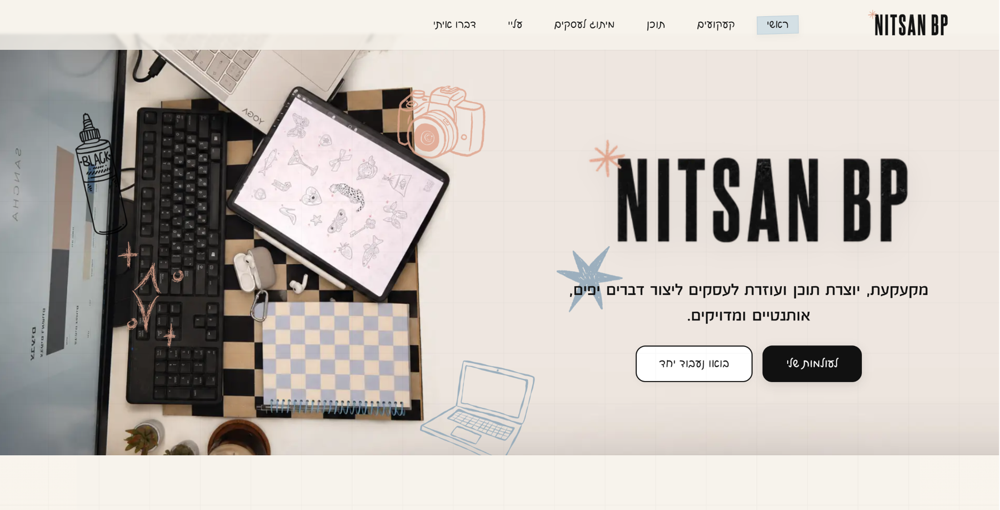
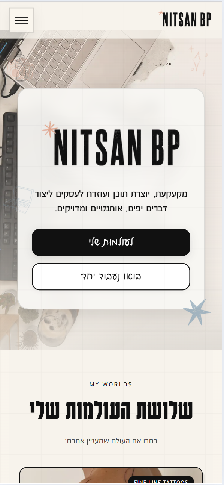
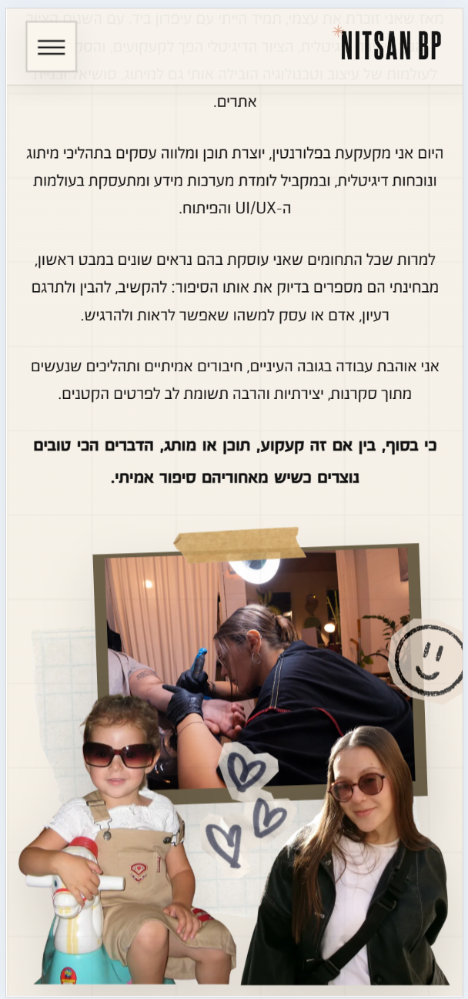
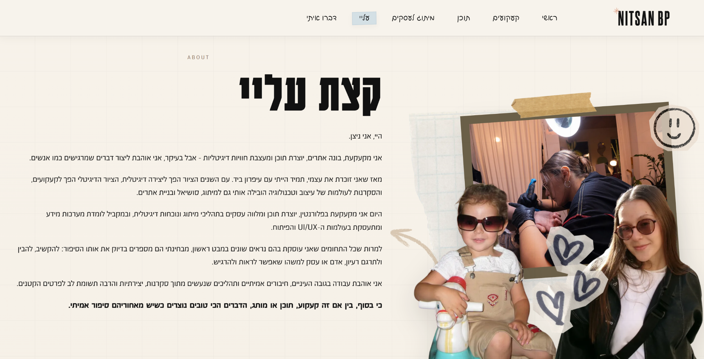
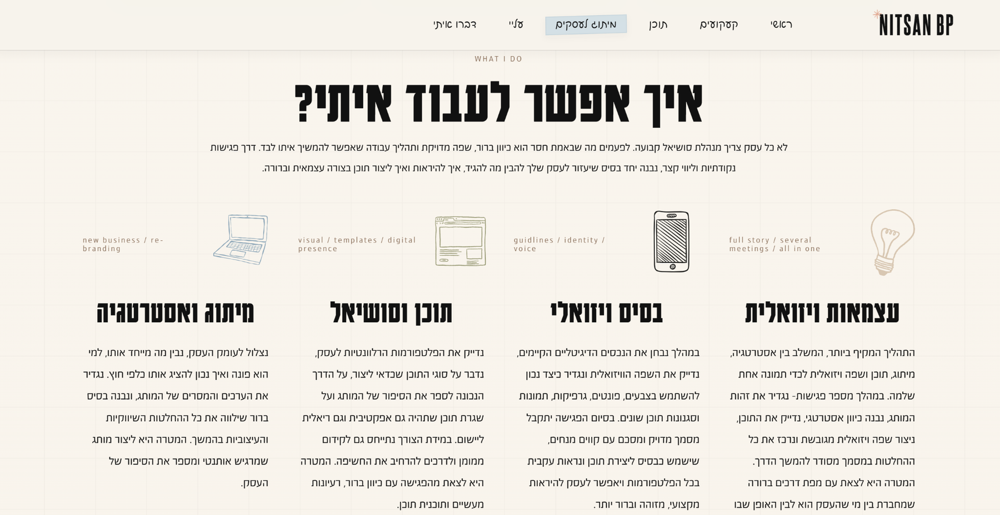
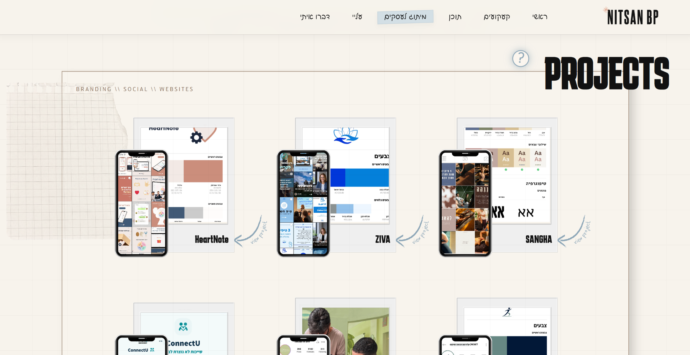
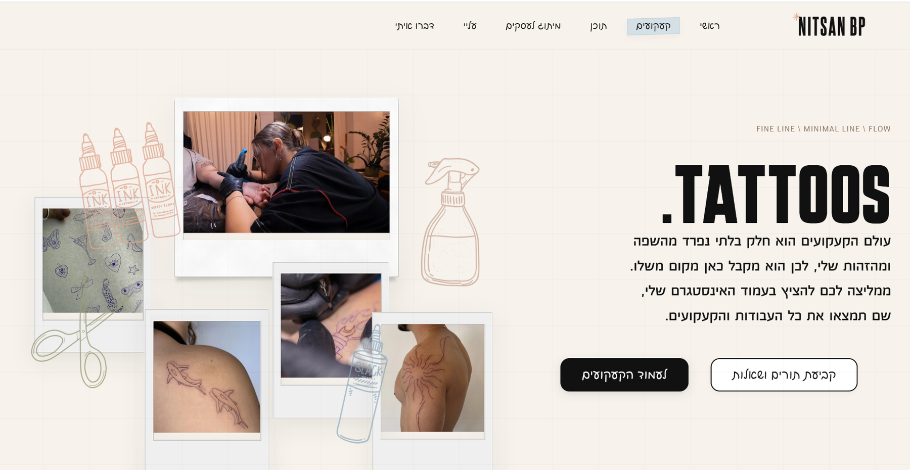

# Personal Brand Website | UI/UX, Visual Identity & Product Design

A **live personal portfolio and business website** designed to bring several creative disciplines into one coherent digital identity: tattoos, social content, branding, websites, and visual work.

The site is deployed under my own custom domain and functions as an active public-facing brand and portfolio experience, not only as a design exercise.

> **Portfolio showcase:** this repository documents the product and design thinking behind the site. The original source repository remains private because it contains large media assets, production-specific contact details, and implementation files that are unnecessary for a portfolio review.

## Visual preview



<p align="center">
  
  
</p>

The live site combines personal branding, business positioning, portfolio storytelling, responsive UI, and a deliberately expressive visual system.

See the full [Product Walkthrough](docs/PRODUCT_WALKTHROUGH.md).

## Design challenge

The main challenge was not simply to create a portfolio page. It was to build one visual system that could represent several different kinds of work without feeling fragmented or generic.

The site needed to answer three questions quickly:

1. Who is Nitsan and what does she do?
2. How do very different services belong to the same personal brand?
3. How can a visually expressive site stay understandable, responsive, and usable?

## Creative direction

The visual language is based on a controlled scrapbook and studio-board aesthetic:

- layered paper and grid textures
- polaroids and phone frames
- tape, arrows, doodles, and hand-made visual elements
- large poster-like typography
- mixed Hebrew RTL and English display language
- photography and project imagery used as part of the composition

The goal was to make the site feel personal, tactile, creative, and recognizably mine rather than like a generic portfolio template.



## Information architecture

The experience is organized around a simple narrative:

```text
Hero
  ↓
Who I am
  ↓
Services
  ↓
How I work
  ↓
Selected work
  ↓
Tattoo work
  ↓
Contact
```

This structure separates identity, commercial services, proof of work, and conversion instead of mixing everything into one gallery.

## Product and UX decisions

### A strong visual identity still needs hierarchy

The scrapbook language creates personality, but too many decorative elements can compete with content. The design system therefore uses a hierarchy of layers:

```text
Background texture
   ↓
Photography / project media
   ↓
Decorative doodles
   ↓
Text and calls to action
```

Content and interaction stay above decoration.

### Services need clear business framing

The website represents several kinds of work, so the service architecture needs to help visitors understand what they can actually hire me for instead of presenting everything as one undifferentiated gallery.



### Different work needs different presentation patterns

A social-media project, a tattoo, and a website are not best communicated through the same card component.

The site uses visual metaphors such as phone frames and polaroids to match the medium being shown while preserving a consistent overall visual language.



The tattoo section adapts the same system to a different discipline through process photography, polaroid framing, and fine-line motifs.



### Mobile cannot be a scaled-down desktop collage

Layered layouts are especially sensitive on small screens. Mobile behavior therefore requires explicit composition decisions, not only responsive width changes.

The UX review focused heavily on:

- horizontal overflow
- overlapping decorative layers
- title scaling
- navigation and tap targets
- readable spacing
- preserving the intended collage without blocking content

### Calls to action need to remain obvious inside a decorative interface

When images, paper textures, and doodles are visually dominant, clickable elements can become ambiguous. CTA hierarchy and clear link treatment are therefore part of the polish process, not an afterthought.

## My role

I led the site from visual concept through UX structure, implementation, launch, and ongoing refinement.

My work included:

- personal brand and creative direction
- information architecture
- page and section hierarchy
- responsive UI/UX decisions
- Hebrew RTL behavior
- visual system and scrapbook composition rules
- portfolio presentation patterns
- interaction and navigation behavior
- front-end implementation in React
- asset optimization decisions
- SEO and social-preview structure
- custom-domain deployment
- iterative UI/UX audit and QA across desktop, tablet, and mobile

The project is especially relevant to my UI/UX and Product Design direction because it required balancing brand expression, business goals, content hierarchy, responsiveness, and implementation constraints in one live experience.

## Iterative design process

The site went through a structured UI/UX audit instead of being treated as complete after the first visual implementation.

The audit identified issues such as:

- decorative overload in some sections
- fragile absolute positioning on mobile
- inconsistent spacing and layer behavior
- unclear distinction between decoration and interaction
- large visual assets affecting performance
- focus and accessibility improvements

These findings were translated into prioritized design and QA work rather than isolated visual tweaks.

See [`docs/UI_UX_CASE_STUDY.md`](docs/UI_UX_CASE_STUDY.md).

## Performance versus visual fidelity

The visual identity uses intentionally rich assets, including paper textures and layered SVG artwork. Several original decorative assets were unusually large, creating a real tradeoff between preserving the design and improving load performance.

The optimization strategy included:

- lazy loading below-the-fold content
- async image decoding where appropriate
- keeping critical above-the-fold assets eager
- reduced-motion-safe interaction polish
- identifying assets that should be re-exported from the source design rather than blindly compressed

See [`docs/PERFORMANCE_AND_QA.md`](docs/PERFORMANCE_AND_QA.md).

## Implementation

The product and visual direction were implemented as a custom responsive React experience rather than a static design mockup.

- React
- Vite
- JavaScript
- Lucide React
- custom local typography
- responsive Hebrew RTL layout
- SEO, Open Graph, sitemap, and structured metadata
- Vercel deployment with custom domain

## Case study documentation

- [Product Walkthrough](docs/PRODUCT_WALKTHROUGH.md)
- [UI/UX Case Study](docs/UI_UX_CASE_STUDY.md)
- [Performance and QA](docs/PERFORMANCE_AND_QA.md)

## Public showcase scope

The showcase intentionally excludes:

- personal phone and direct-contact implementation details
- full production media library
- very large raw video assets
- local font files
- private source history
- unnecessary production-specific links

See [`SECURITY.md`](SECURITY.md).

## What I would improve next

If continuing the site as a product-design exercise, I would focus on:

1. tighter component rules for scrapbook layers and decorative density
2. stronger service hierarchy based on business goals
3. formal accessibility testing beyond visual QA
4. responsive asset variants for heavy decorative media
5. interaction analytics to understand which services and projects users explore
6. continued reduction of mobile layout fragility

---

**Project:** Nitsan BP Personal Website  
**Status:** Live custom-domain personal brand website  
**Focus:** UI/UX · product design · visual identity · responsive design · personal branding · technical execution
